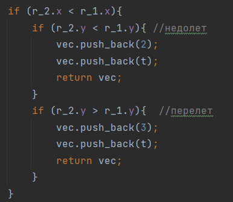
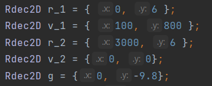

**Отчет по задаче «Про ядра и противоядра»**

Введем обозначения:

1. Ядро – некая материальная точка, вылетающая из точки с ранее заданными координатами.
1. Противоядро – другая материальная точка, также вылетающая из точки с ранее заданными координатами.

Условия задачи:

1. Известны радиус-вектор ядра, вектор скорости ядра, радиус-вектор противоядра, вектор ускорения свободного падения (работает для обоих ядер одинаково)
1. Вектор скорости противоядра неизвестен
1. Ядро находится левее противоядра
1. В какой-то момент ядро запускается в сторону противоядра
1. Противоядро можно запускать строго после того, как до него дойдет звук от выстрела ядра
1. Вектор ускорения свободного падения g = {0; -9,8}
1. Скорость звука равна 300

Наша задача: подобрать вектор скорости противоядра, чтобы сбить ядро с наибольшей точностью.

Опишем основной алгоритм симуляции движения ядер до некоторого момента времени:

r\_1 – радиус-вектор ядра;

r\_2 – радиус-вектор противоядра;

v\_1 – вектор скорости ядра;

v\_2 – вектор скорости противоядра;

t – время; t\_of\_sound – время, за которое звук дойдет от ядра до противоядра;

g – вектор ускорения свободного падения;

Как мы видим, вычисление координат противоядра начинается строго после того, как звук от выстрела ядром дошел до противоядра.

Решение основной задачи:

1. Написал функцию, которая принимает на вход радиус-векторы ядра и противоядра, векторы скорости ядра и противоядра, единицу изменения времени и расстояние, которое должно быть между ядрами, чтобы мы считали их столкнувшимися (delta\_s). 
1. Функция симулирует движение ядер и возвращает флаги, соответствующие их столкновению, а также недолету и перелету противоядра.

Проверка на столкновение:

Условие столкновения: расстояние между ядрами должно быть меньше или равно расстоянию, достаточному для столкновения (delta\_s)
(В вектор vec добавляется: 1 – флаг столкновения, время столкновения)

Проверка на недолет и перелет: 

1. В основной функции main в трех вложенных циклах мы перебираем векторы скорости противоядра по осям OX и OY, а также точность попадания (delta\_s). Для каждой скорости мы с помощью функции collision\_of\_cores проверяем, подходит ли нам скорость. 

   Рассмотрим самый первый подобранный вектор скорости, с которой противоядро собьет ядро. Так как расстояние, достаточное для столкновения (delta\_s), для этого вектора будет минимальным (так как мы перебираем delta\_s от меньшего к большему), точность попадания противоядра с рассматриваемым вектором будет самой высокой. То есть запуск противоядра с данной скоростью будет наиболее эффективным.

   Считая, что мы ищем самый эффективный способ запуска (мы очень сильно хотим сбить ядро), мы запоминаем найденную скорость противоядра и выходим из всех вложенных циклов.
   
1. Далее, используя подобранную скорость противоядра, в основной функции main мы симулируем движение ядер до момента их столкновения. Записываем координаты их расположения в каждый момент времени. Строим график по этим координатам.

Пример работы программы:

Входные данные:

Известны: расположение ядра и противоядра, скорость ядра, ускорение свободного падения.

В результате работы программа подобрала скорость, с которой противоядро гарантированно собьет ядро. Ее вектор равен {20;970}

При таких параметрах потивоядро собьет ядро через 35 секунд после запуска ядра. Точность сбития – 50 (будем считать, что при приближении любого объекта ближе, чем на 50, противоядро взрывается и уничтожает все вокруг).

